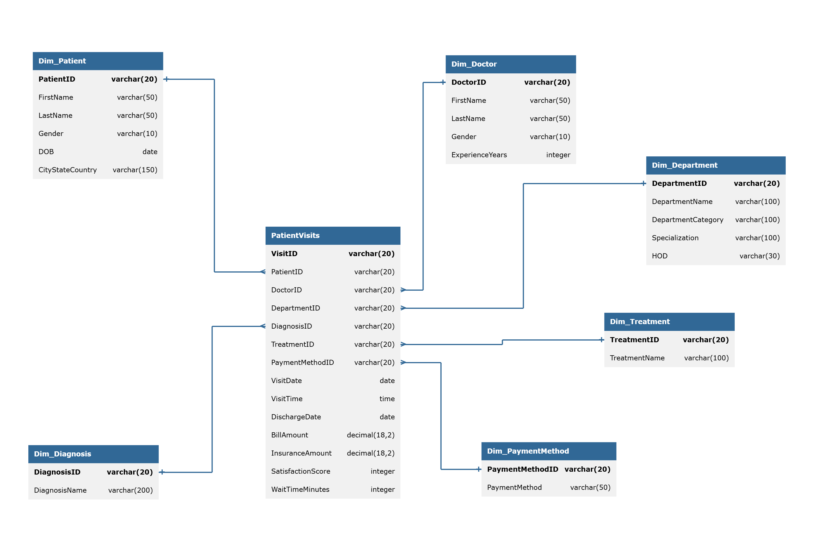
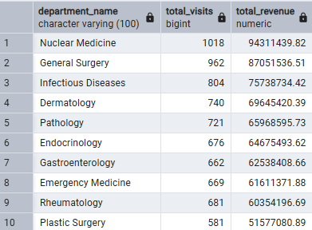
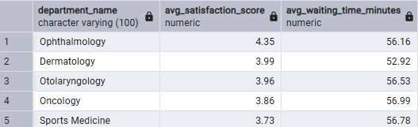
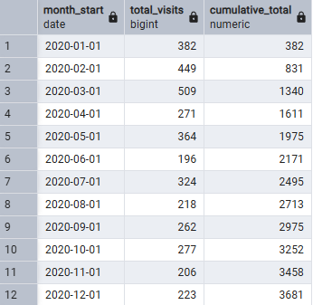

# 🏥 Hospital Data Analytics Project (SQL)

This project simulates a hospital data warehouse and demonstrates analytical SQL skills using a star schema model.

## 🗂️ Data Model (Star Schema)

The database is built using a **star schema**:

- **Fact table**: PatientVisits
- **Dimension tables**:
  - Patients
  - Doctors
  - Departments
  - Diagnoses
  - Treatments
  - Payment Methods
  
This structure reflects how real analytical databases are designed.

The goal of the project is to analyze hospital visits, patients, doctors, departments, diagnoses, treatments, and payments using advanced SQL techniques.

## 🧹 Data Cleaning & Transformation

Before analysis, raw data was cleaned and transformed:

- Standardized patient names and gender values
- Split location into city, state, and country
- Removed incomplete records
- Simplified department structure
- Merged yearly visit tables into a single fact table

See `data_cleaning.sql` for details.

## 🧠 Analytical Tasks Performed

The analysis includes:

- Counting distinct patients per doctor
- Revenue split by payment method
- Patient age group analysis
- Department revenue and ranking
- Satisfaction score and wait time analysis
- Weekday vs weekend visit comparison
- Monthly visits with running totals
- Top doctors by satisfaction score
- Most commonly prescribed treatments per diagnosis

The queries use:

- JOINs across multiple tables
- GROUP BY and aggregations
- CTEs (Common Table Expressions)
- Window functions (RANK, ROW_NUMBER, running totals)
- Date and age calculations

---

## ⚙️ How to Run the Project

1. Run `01_schema.sql` to create tables
2. Run: `02_dept_treatment_diagnosis_payment_data.sql`, `03_patients_data.sql`, `04_doctors_data.sql`, `05_patientvisits_data.sql` to insert data
3. Run: `data_cleaning.sql`
4. Run: `analysis_queries.sql`

The project is written for PostgreSQL.

---

## 💡 Skills Demonstrated

- Data modeling (star schema)
- Analytical SQL
- Window functions
- Data aggregation and grouping
- Working with dates and derived metrics

- ## 📸 Example Query Results
- ### Q1 – Number of distinct patients for each doctor.

### Q2 – Revenue split by each payment method, along with total visits.

### Q3 – Average bill amount and number of visits by age group.

### Q4 – Total revenue and number of visits for each department.

### Q5 – Department revenue ranking within category.

### Q6 – Average satisfaction score and average wait time for each department.

### Q7 –  Comparition of the total number of hospital visits on weekdays vs weekends.

### Q8 – Monthly visits with running total.

### Q9 – Doctors with the highest average satisfaction score.

### Q10 – Most common treatment per diagnosis.

